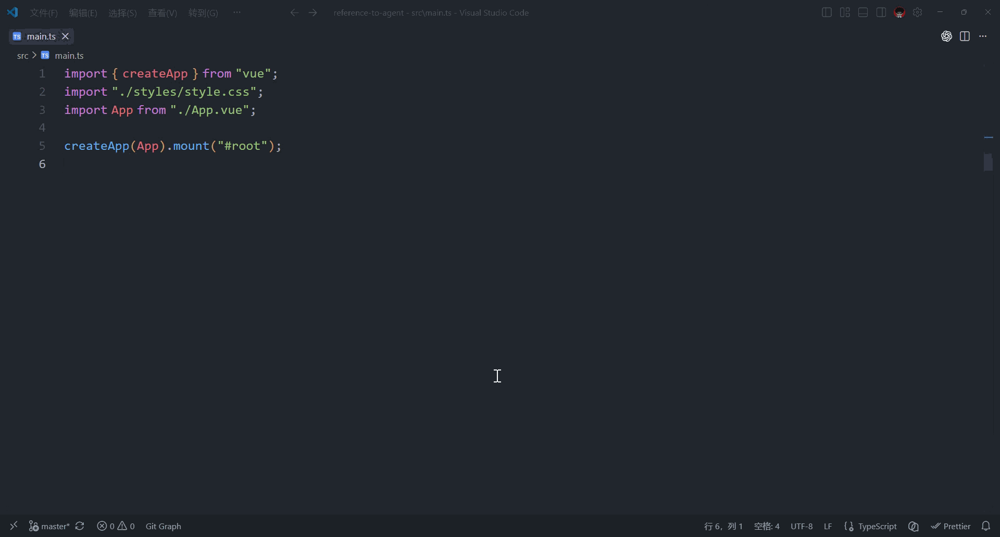
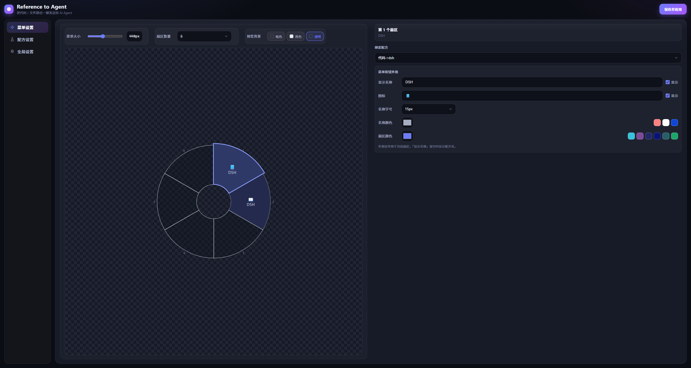
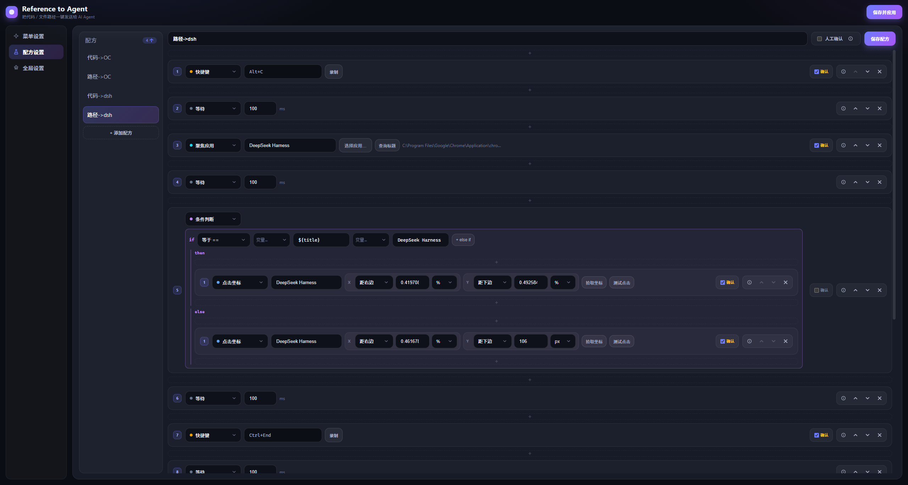

# Reference to Agent

Windows 桌面小工具：在 IDE 中选中代码（或复制文件路径）后，按全局快捷键在鼠标旁弹出**圆盘菜单**，一键执行自定义「动作配方」——例如把选中代码自动发送给 Claude Desktop 等 AI Agent 桌面应用的输入框。

技术栈：**Tauri 2（Rust）+ Vue 3（Vite + TypeScript）**，常驻系统托盘，配置保存即生效。



## 为什么做这个

很多桌面 AI 应用没有开放 API，无法直接对接。本工具通过跨应用 UI 自动化（注入按键 + 窗口切换）把「复制 → 切窗 → 粘贴 → 发送」这类固定操作序列封装成一键配方，全程可视化配置，无需写脚本。

## 功能

- **全局快捷键**：默认 `Ctrl+Alt+R` 在鼠标位置弹出圆盘菜单（再按一次收起），`Ctrl+Alt+L` 弹出完整配方列表；均可在设置中重新录制。
- **圆盘菜单**：扇区数量、直径、每个扇区绑定的配方 / 图标（emoji）/ 颜色 / 名称样式全部可自定义，支持数字键快速触发，`Esc` 或失焦关闭。

  

- **动作配方**：一个配方 = 按顺序执行的步骤序列，内置丰富的步骤原语（见下文「步骤类型」）。

  

- **条件分支**：`if / else-if / else` 步骤支持等于、大于、前缀、包含、正则匹配等比较操作，可嵌套任意步骤。
- **人工确认**：配方可开启人工确认模式，被标记的步骤执行前弹窗确认（`Enter` 执行 / `Esc` 取消），防止误触发。
- **可视化设置**：增删配方、编辑步骤、录制热键、从本机已安装应用中选择目标窗口、拾取点击坐标，全部图形化完成；保存后立即生效，无需重启。
- **常驻托盘**：主窗口关闭后隐藏到托盘，随开随用。

## 快速上手

1. 在 [Releases](../../releases) 下载 `reference-to-agent.exe`（或自行构建，见下文「开发」）。
2. 在 VS Code / JetBrains 中选中一段代码。
3. 按 `Ctrl+Alt+R` → 圆盘出现在鼠标旁 → 点击「发送选中代码到 Claude」。
4. 配方自动执行：复制选中内容 → 切换到 Claude 窗口 → 聚焦输入框 → 粘贴 → 发送 → 恢复剪贴板。

### 复制文件路径

- **JetBrains 系**：默认 `Ctrl+Shift+C` 即「复制引用」，无需配置。
- **VS Code**：默认没有复制路径快捷键，需在 `keybindings.json` 给 `workbench.action.files.copyPathOfActiveFile` 绑定快捷键，然后修改对应配方里的 `hotkey` 步骤。

## 配置

设置界面（托盘或菜单 → 设置）分为三个面板：

- **菜单设置**：圆盘直径、扇区数、每个扇区绑定的配方及图标 / 颜色 / 名称样式，带实时预览。
- **配方设置**：左侧列表增删配方；选中后编辑名称与步骤。步骤可增删、拖拽调整顺序，快捷键类步骤支持录制；「激活应用 / 聚焦应用」可通过「选择应用…」从本机已安装应用（开始菜单快捷方式 + 商店应用）中选取，自动填入标题与 exe 路径（商店应用填入 `shell:AppsFolder\<AUMID>`，运行时按标题聚焦、未启动时按 AUMID 拉起）；`click` 步骤提供「拾取坐标」与「测试点击」辅助。
- **全局设置**：两个全局快捷键（圆盘菜单 / 配方列表）的录制。

配置最终写入 `%APPDATA%\com.fengy.reference-to-agent\config.json`，保存后自动重新注册全局快捷键。

### 步骤类型

| type | 参数 | 说明 |
|---|---|---|
| `wait` | `ms` | 等待毫秒数 |
| `hotkey` | `keys` | 注入组合键，如 `Ctrl+Shift+C`、`Enter`、`Alt+Tab` |
| `activateApp` | `title`、`exe?` | 按标题模糊匹配激活窗口；未找到且给了 `exe` 时先启动该程序并等待窗口出现（商店应用传 `shell:AppsFolder\<AUMID>`）。多个同应用窗口时优先当前虚拟桌面、再取最近激活的窗口 |
| `focusApp` | `title`、`exe?` | 聚焦已打开的应用窗口（按标题模糊匹配，不启动新进程）。窗口选择策略同上 |
| `setClipboard` | `text` | 写入剪贴板 |
| `typeText` | `text` | 逐字输入文本（受输入法影响，慎用于中文） |
| `pasteText` | `text` | 写入剪贴板并粘贴（对中文 / 长文本可靠） |
| `runCommand` | `cmd`、`args` | 运行外部命令 |
| `click` | `title`、`x`、`y` | 在标题匹配的窗口内模拟鼠标左键点击，用于聚焦输入框等控件。`x`/`y` 各自独立定位：`base` 取 `left`/`right`/`top`/`bottom`（相对哪条边），`value` 为偏移量，`unit` 取 `percent`（0~1）或 `px`。沉底输入框建议 `x={base:left,value:0.5,unit:percent}`、`y={base:bottom,value:0.08,unit:percent}` |
| `if` | `op`、`value`、`expected`、`then`、`elseIf`、`else` | 条件分支：比较操作符支持 `eq/ne/gt/ge/lt/le/startsWith/endsWith/contains/matches`（正则），分支内可嵌套任意步骤 |
| `rollbackClipboard` | 无 | 把剪贴板恢复为配方执行前的原始内容（放在复制/粘贴类步骤之后，避免覆盖用户原有剪贴板） |

所有步骤均可附加 `confirm: true`，在配方开启「人工确认」时执行前弹窗询问。

> `activateApp` 的 `title` 按「包含」匹配窗口标题；给多个目标 agent 建配方时，各自指定自己的 `title` 即可。目标应用未运行时，配好 `exe` 全路径后可自动拉起。

## 开发

```bash
npm install
npm run tauri dev      # 开发模式
npm run tauri build    # 打包
```

注意：本机使用 MSYS2 mingw64（GNU）工具链编译，`npm run tauri` 已自动把 `C:\msys64\mingw64\bin` 注入 `PATH`（供 `windres`/链接器使用），直接运行即可，无需手动配置环境变量；`lib` 的 `crate-type` 只保留 `lib` 以规避 GNU 链接器导出符号问题。若改用其他机器，请按需调整 `package.json` 里的路径，或使用 MSVC 工具链。

## 局限与注意

- 本质是跨应用 UI 自动化（注入按键 + 切窗），对目标应用窗口标题、输入框行为敏感；目标应用改版可能影响对应配方。
- 执行序列的时序（等待毫秒）可能需要按目标应用启动速度微调。
- 发送代码到外部 AI 服务属于数据外发，请确认内容允许。
- 目标 AI 应用若有官方 CLI（如 Claude Code），脚本直连更稳定；本工具面向「无 API 的桌面 GUI 应用」场景。

## License

[MIT](LICENSE)
